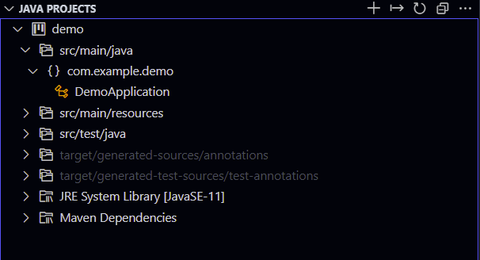

# JavaSpringApp

A repo to test drive some java quickstarts/extensions/etc

## Origin

1. Bootstrapped from [start.spring.io](https://start.spring.io/#!type=maven-project&language=java&platformVersion=2.6.8-SNAPSHOT&packaging=jar&jvmVersion=11&groupId=com.example&artifactId=demo&name=demo&description=Demo%20project%20for%20Spring%20Boot&packageName=com.example.demo&dependencies=azure-support,azure-storage,azure-keyvault-secrets,sqlserver,azure-cosmos-db,azure-active-directory)

2. Spring boot Initialize https://code.visualstudio.com/docs/java/java-spring-boot#_create-the-project

## Process cmds and dumps

```bash
mvn --version

Apache Maven 3.8.5 (3599d3414f046de2324203b78ddcf9b5e4388aa0)
Maven home: C:\ProgramData\chocolatey\lib\maven\apache-maven-3.8.5
Java version: 11.0.7, vendor: AdoptOpenJDK, runtime: C:\Program Files\AdoptOpenJDK\jdk-11.0.7.10-hotspot
Default locale: en_GB, platform encoding: Cp1252
OS name: "windows 10", version: "10.0", arch: "amd64", family: "windows"
```

```bash
mvn spring-boot:run

  .   ____          _            __ _ _
 /\\ / ___'_ __ _ _(_)_ __  __ _ \ \ \ \
( ( )\___ | '_ | '_| | '_ \/ _` | \ \ \ \
 \\/  ___)| |_)| | | | | || (_| |  ) ) ) )
  '  |____| .__|_| |_|_| |_\__, | / / / /
 =========|_|==============|___/=/_/_/_/
 :: Spring Boot ::       (v2.6.8-SNAPSHOT)
2022-04-26 13:18:35.594  INFO 41600 --- [           main] com.example.demo.DemoApplication         : Started DemoApplication in 2.525 seconds (JVM running for 3.188)
[INFO] ------------------------------------------------------------------------
[INFO] BUILD SUCCESS
[INFO] ------------------------------------------------------------------------
[INFO] Total time:  01:39 min
[INFO] Finished at: 2022-04-26T13:18:35+01:00
[INFO] ------------------------------------------------------------------------
```

### Java in VSCode

Neat extension panel



[Springboot dashboard extension](https://marketplace.visualstudio.com/items?itemName=vscjava.vscode-spring-boot-dashboard
)

Spring boot extension


## Refs

- https://vaadin.com/learn/tutorials/vs-code-for-java-and-maven-projects
- https://code.visualstudio.com/docs/java/java-spring-boot